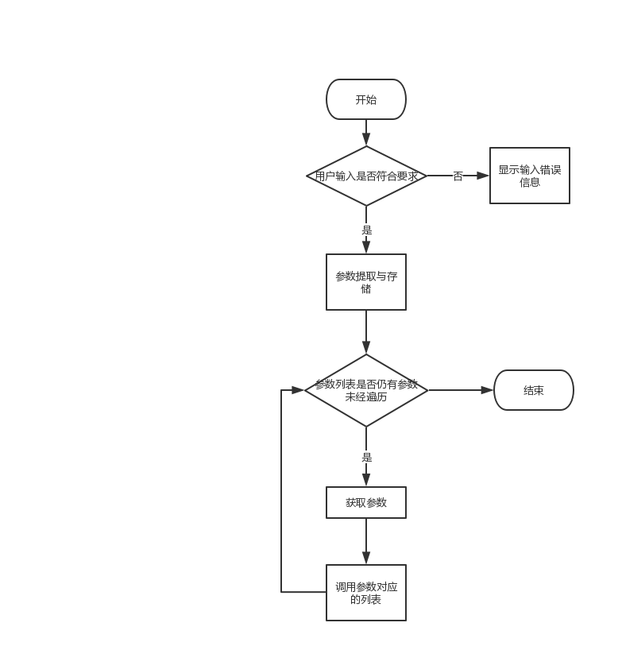

# 软件工程个人作业（wc.exe项目）
## 一、项目Github地址
<https://github.com/huangzihaohzh/WordCounter>

## 二、PSP表格
<table border="0" cellpadding="0" cellspacing="0" width="869" style="border-collapse:
 collapse;table-layout:fixed;width:652pt;word-break:break-word;font-variant-ligatures: normal;
 font-variant-caps: normal;orphans: 2;text-align:start;widows: 2;-webkit-text-stroke-width: 0px;
 text-decoration-style: initial;text-decoration-color: initial">
 <colgroup><col width="330" style="mso-width-source:userset;mso-width-alt:11719;width:247pt">
 <col width="289" style="mso-width-source:userset;mso-width-alt:10268;width:217pt">
 <col width="125" span="2" style="mso-width-source:userset;mso-width-alt:4437;
 width:94pt">
 </colgroup><tbody><tr height="19" style="height:14.4pt">
  <td height="19" class="xl65" width="330" style="height:14.4pt;width:247pt">PSP2.1</td>
  <td class="xl65" width="289" style="border-left:none;width:217pt">Personal
  Software Process Stages</td>
  <td class="xl65" width="125" style="border-left:none;width:94pt">预估耗时（分钟）</td>
  <td class="xl65" width="125" style="border-left:none;width:94pt">实际耗时（分钟）</td>
 </tr>
 <tr height="19" style="height:14.4pt">
  <td height="19" class="xl66" style="height:14.4pt;border-top:none">Planning</td>
  <td class="xl66" style="border-top:none;border-left:none">计划</td>
  <td class="xl66" align="right" style="border-top:none;border-left:none">60</td>
  <td class="xl66" align="right" style="border-top:none;border-left:none">90</td>
 </tr>
 <tr height="19" style="height:14.4pt">
  <td height="19" class="xl66" style="height:14.4pt;border-top:none">· Estimate</td>
  <td class="xl66" style="border-top:none;border-left:none">· 估计这个任务需要多少时间</td>
  <td class="xl66" align="right" style="border-top:none;border-left:none">60</td>
  <td class="xl66" align="right" style="border-top:none;border-left:none">90</td>
 </tr>
 <tr height="19" style="height:14.4pt">
  <td height="19" class="xl66" style="height:14.4pt;border-top:none">Development</td>
  <td class="xl66" style="border-top:none;border-left:none">开发</td>
  <td class="xl66" align="right" style="border-top:none;border-left:none">1260</td>
  <td class="xl66" align="right" style="border-top:none;border-left:none">1320</td>
 </tr>
 <tr height="19" style="height:14.4pt">
  <td height="19" class="xl66" style="height:14.4pt;border-top:none">· Analysis</td>
  <td class="xl66" style="border-top:none;border-left:none">· 需求分析&nbsp;</td>
  <td class="xl66" align="right" style="border-top:none;border-left:none">60</td>
  <td class="xl66" align="right" style="border-top:none;border-left:none">45</td>
 </tr>
 <tr height="19" style="height:14.4pt">
  <td height="19" class="xl66" style="height:14.4pt;border-top:none">· Design Spec</td>
  <td class="xl66" style="border-top:none;border-left:none">· 生成设计文档</td>
  <td class="xl66" align="right" style="border-top:none;border-left:none">60</td>
  <td class="xl66" align="right" style="border-top:none;border-left:none">90</td>
 </tr>
 <tr height="19" style="height:14.4pt">
  <td height="19" class="xl66" style="height:14.4pt;border-top:none">· Design
  Review</td>
  <td class="xl66" style="border-top:none;border-left:none">· 设计复审&nbsp;</td>
  <td class="xl66" align="right" style="border-top:none;border-left:none">60</td>
  <td class="xl66" align="right" style="border-top:none;border-left:none">45</td>
 </tr>
 <tr height="19" style="height:14.4pt">
  <td height="19" class="xl66" style="height:14.4pt;border-top:none">· Coding
  Standard</td>
  <td class="xl66" style="border-top:none;border-left:none">· 代码规范</td>
  <td class="xl66" align="right" style="border-top:none;border-left:none">30</td>
  <td class="xl66" align="right" style="border-top:none;border-left:none">90</td>
 </tr>
 <tr height="19" style="height:14.4pt">
  <td height="19" class="xl66" style="height:14.4pt;border-top:none">· Design</td>
  <td class="xl66" style="border-top:none;border-left:none">· 具体设计</td>
  <td class="xl66" align="right" style="border-top:none;border-left:none">60</td>
  <td class="xl66" align="right" style="border-top:none;border-left:none">150</td>
 </tr>
 <tr height="19" style="height:14.4pt">
  <td height="19" class="xl66" style="height:14.4pt;border-top:none">· Coding</td>
  <td class="xl66" style="border-top:none;border-left:none">· 具体编码</td>
  <td class="xl66" align="right" style="border-top:none;border-left:none">540</td>
  <td class="xl66" align="right" style="border-top:none;border-left:none">480</td>
 </tr>
 <tr height="19" style="height:14.4pt">
  <td height="19" class="xl66" style="height:14.4pt;border-top:none">· Code Review</td>
  <td class="xl66" style="border-top:none;border-left:none">· 代码复审</td>
  <td class="xl66" align="right" style="border-top:none;border-left:none">90</td>
  <td class="xl66" align="right" style="border-top:none;border-left:none">60</td>
 </tr>
 <tr height="19" style="height:14.4pt">
  <td height="19" class="xl66" style="height:14.4pt;border-top:none">· Test</td>
  <td class="xl66" style="border-top:none;border-left:none">· 测试（自我测试，修改代码，提交修改）</td>
  <td class="xl66" align="right" style="border-top:none;border-left:none">360</td>
  <td class="xl66" align="right" style="border-top:none;border-left:none">360</td>
 </tr>
 <tr height="19" style="height:14.4pt">
  <td height="19" class="xl66" style="height:14.4pt;border-top:none">Reporting</td>
  <td class="xl66" style="border-top:none;border-left:none">报告</td>
  <td class="xl66" align="right" style="border-top:none;border-left:none">180</td>
  <td class="xl66" align="right" style="border-top:none;border-left:none">160</td>
 </tr>
 <tr height="19" style="height:14.4pt">
  <td height="19" class="xl66" style="height:14.4pt;border-top:none">· Test Report</td>
  <td class="xl66" style="border-top:none;border-left:none">· 测试报告</td>
  <td class="xl66" align="right" style="border-top:none;border-left:none">120</td>
  <td class="xl66" align="right" style="border-top:none;border-left:none">120</td>
 </tr>
 <tr height="19" style="height:14.4pt">
  <td height="19" class="xl66" style="height:14.4pt;border-top:none">· Size
  Measurement</td>
  <td class="xl66" style="border-top:none;border-left:none">· 计算工作量</td>
  <td class="xl66" align="right" style="border-top:none;border-left:none">30</td>
  <td class="xl66" align="right" style="border-top:none;border-left:none">20</td>
 </tr>
 <tr height="19" style="height:14.4pt">
  <td height="19" class="xl66" style="height:14.4pt;border-top:none">· Postmortem
  &amp; Process Improvement Plan</td>
  <td class="xl66" style="border-top:none;border-left:none">· 事后总结, 并提出过程改进计划</td>
  <td class="xl66" align="right" style="border-top:none;border-left:none">30</td>
  <td class="xl66" align="right" style="border-top:none;border-left:none">20</td>
 </tr>
 <tr height="19" style="height:14.4pt">
  <td height="19" class="xl66" style="height:14.4pt;border-top:none">合计</td>
  <td class="xl66" style="border-top:none;border-left:none">　</td>
  <td class="xl66" align="right" style="border-top:none;border-left:none">1500</td>
  <td class="xl66" align="right" style="border-top:none;border-left:none">1570</td>
 </tr>
 <tr height="28" style="height:21.0pt">
  <td height="28" class="xl67" style="height:21.0pt"></td>
  <td></td>
  <td></td>
  <td></td>
 </tr>
 <!--[if supportMisalignedColumns]-->
 <tr height="0" style="display:none">
  <td width="330" style="width:247pt"></td>
  <td width="289" style="width:217pt"></td>
  <td width="125" style="width:94pt"></td>
  <td width="125" style="width:94pt"></td>
 </tr>
 <!--[endif]-->
</tbody></table>

## 三、解题思路
1. 阅读需求文档（个人项目文档）,大致了解题目的要求。由需求文档可知，题目要求编写一个根据用户输入的参数,对文本文件进行字符、单词、行数的技术并显示。此外还需要对所编程序进行测试，并按要求填写PSP表格以及撰写博文；
2. 为了更合理地进行设计，决定先阅读下《构建之法》,了解了PSP表格的制订、回归测试的设计以及软件工程的工作量和质量的衡量标准等；
3. 对于本项目，对用户的输入需要进行检查和分为参数组和文件名两项，考虑用正则表达式来进行处理，对于各类计数功能的实现也考虑用正则表达式去实现，对于“-a”选项对应的代码行 / 空行 / 注释行的处理则相对复杂一点，需要进一步寻找资料。

## 四、设计实现过程
### 主要涉及与实现
1. 用户输入检查：使用正则表达式对用户输入的参数和地址进行检查，检查输入是否符合参数格式以及地址格式是否正确；
2. 参数提取与存储：对用户输入进行分类存储，用户输入参数存到参数列表中，地址/文件名存入到一个字符串字段中。
3. 按用户参数进行不同的操作：遍历参数列表，对不同的参数调用对应的方法获取计数值并加以显示。  
### 流程图如下


## 五、测试
### 单元测试
#### 测试代码
```
public class Test {
    private TextFile textFile = null;


    //Constructor
    public Test(String filePath) throws Exception{
        this.textFile = new TextFile(filePath);
    }

    //测试TextFile.charNumCounter()
    public void testCharNumCounter(){
        int charNum = textFile.charNumCounter();
        if(charNum>=0)
            System.out.println("文件字符数为："+charNum);
        else
            System.out.println("字符数计算出错");
    }

    //测试TextFile.wordNumCounter()
    public void testWordNumCounter(){
        int wordNum = textFile.wordNumCounter();
        if(wordNum>=0)
            System.out.println("文件单词数为："+wordNum);
        else
            System.out.println("单词计算出错");
    }

    //测试TextFile.lineNumCounter()
    public void testLineNumCounter() throws IOException {
        int lineNum = textFile.lineNumCounter();
        if(lineNum>=0)
            System.out.println("文件行数为："+lineNum);
        else
            System.out.println("行数计算错误");
    }
}
```
#### 测试结果
```
D:\123.txt
文件字符数为：80
文件单词数为：6
文件行数为：2
```
### 整体测试
#### 空文件测试（内有一空行，文件大小0KB）
命令：java -jar wc.jar -c -w -l "D:\test_txt\Empty.txt"  
测试结果：
```
文件字符数为：0
文件单词数为：0
文件行数为：1
```
#### 只有一个字符的文件测试
命令：java -jar wc.jar -c -w -l "D:\test_txt\OnlyOneChar.txt"  
测试结果：
```
文件字符数为：1
文件单词数为：0
文件行数为：1
```
#### 只有一个词的文件测试
命令：java -jar wc.jar -c -w -l "D:\test_txt\OnlyOneWord.txt"  
测试结果：
```
文件字符数为：4
文件单词数为：1
文件行数为：1
```
#### 只有一行的文件测试
命令：java -jar wc.jar -c -w -l "D:\test_txt\OnlyOneLine.txt"  
测试结果：
```
文件字符数为：59
文件单词数为：3
文件行数为：1
```
#### 一个典型的源文件测试
命令：java -jar wc.jar -c -w -l "D:\test_txt\Current.txt"  
测试结果：
```
文件字符数为：27
文件单词数为：6
文件行数为：2
```
#### -x参数测试
命令：java -jar wc.jar -x -c -w -l  
测试结果：
```
D:\test_txt\OnlyOneChar.txt
文件字符数为：1
文件单词数为：0
文件行数为：1
```
#### 测试图片


## 总结
在本次项目开发过程中，有以下几点总结与教训：  
1. 要加大前期计划与分析的时间投入
2. 拒绝拖延症，早开始，早结束